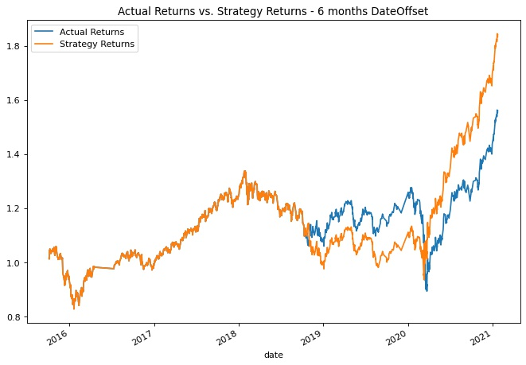
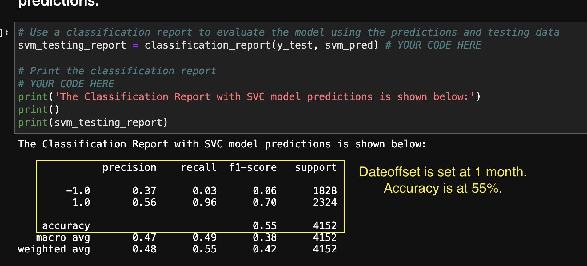

# **Module 14 Challenge: Machine Learning Trading Bot**

## Table of Contents

[Machine Learning Trading Bot Overview](https://github.com/juzcho/Module_14_Challenge_Machine_Learning_Trading_Bot#machine-learning-trading-bot-overview)

[Technologies](https://github.com/juzcho/Module_14_Challenge_Machine_Learning_Trading_Bot#technologies)

[Installation Guide](https://github.com/juzcho/Module_14_Challenge_Machine_Learning_Trading_Bot#installation-guide)

[Project Analysis and Report](https://github.com/juzcho/Module_14_Challenge_Machine_Learning_Trading_Bot#project-analysis-and-report)

[Examples](https://github.com/juzcho/Module_14_Challenge_Machine_Learning_Trading_Bot#examples)

[Contributors](https://github.com/juzcho/Module_14_Challenge_Machine_Learning_Trading_Bot#contributors)

[License](https://github.com/juzcho/Module_14_Challenge_Machine_Learning_Trading_Bot#license)

---

## Machine Learning Trading Bot Overview

This project is about improving the existing algorithmic trading systems and maintain the firm’s competitive advantage in the market. We have a baseline trading algorithm and baseline model that we use at the firm. This project takes into account different variables that could change the returns on the trading algorithm. We use a different machine learning model to check the viability of it being a better model to use it yielding better returns.

---

## Technologies

This project leverages **[python version 3.8.5](https://www.python.org/downloads/)** with the following packages and modules:

* [pandas](https://pandas.pydata.org/docs/) - This was used to be able to easily manipulate dataframes.

  * [DateOffset](https://pandas.pydata.org/pandas-docs/stable/reference/offset_frequency.html) - This was used as a standard kind of date increment used for a date range.

* [Jupyter Lab](https://jupyterlab.readthedocs.io/en/stable/) - This was used to be able to create and share documents that contain live code, equations, visualizations and narrative text.

* [PyVizlot](https://pyviz.org/) -  Python visualization package that provides a single platform for accessing multiple visualization libraries. Two of the libraries are:

  * [hvplot.pandas](https://hvplot.holoviz.org/user_guide/Introduction.html) - *version 0.7.2* - For the interactive visualization of the crowdfunding data.

* [Scikit Learn](https://scikit-learn.org/stable/) - *version 0.24.2* - This package has a lot of different tools and model that could be use to create a machine learning model.

    * [Standard Scaler](https://scikit-learn.org/stable/modules/generated/sklearn.preprocessing.StandardScaler.html) - Standardize features by removing the mean and scaling to unit variance.
    
    * [OneHotEncoder](https://scikit-learn.org/stable/modules/generated/sklearn.preprocessing.OneHotEncoder.html) - Encode categorical features as a one-hot numeric array.
    
    * [linear model](https://scikit-learn.org/stable/modules/linear_model.html) - This allows the model to call the Logisitic Regression model to run our machine learning.

    * [Classification report](https://scikit-learn.org/stable/modules/generated/sklearn.metrics.classification_report.html) - This will build a text report showing the main classification metrics i.e. accuracy score, precision, recall, f1 score, etc.
  
* [Numpy](https://numpy.org/) - This provides the ability to work with arrays and use different mathematical calculations on arrays.

---
## Installation Guide

### 1. Installing and Running Jupyter notebook

On the terminal, under the conda dev environment, type the code below:

`pip install jupyterlab`

#### * Opening Jupyter notebook

If you have Jupyter Lab already installed, to open your Notebook and be able to view your hidden files, please type this while on your conda dev environment:

`jupyter lab --ContentsManager.allow_hidden=True` 

Once you click ENTER, this will open on your default browser.

### 2. Installing Scikit-learn
- To install the Scikit-learn, check that your development environment is active, and then run the following command:

    `pip install -U scikit-learn`

- To check if scikit-learn is already installed, you can run the following code on your dev environment:

    `conda list scikit-learn`

  

---

## Project Analysis and Report
 
### 1. What impact resulted from increasing or decreasing the training window?

#### **Answer**:

* Increasing the training window to six (6) months: This increased accuracy score to 56%. Also, it improved the recall on 1.0 to 98% which was previously 96%. It also improved the Strategy Returns to more than 1.8.

* Increasing the training window to eight (8) months: This decreased accuracy score to 54%. Also, it decreased our recall on 1.0 to 83%, which was previously 96%. It also improved the Actual Returns to at least a 1.6, which was previously at 1.4 and significantly decreased Strategy Returns to 1.35.

* Decreasing the training window to one (1) month: This also increased accuracy score to 55%. Also, its precision for detecting -1.0 was decreased to 37% versus our baseline which is 43%. Additionally, the Strategy Returns at 1.38 versus on our baseline of over 1.5, also it apparently decreased our Actual Returns as well.

### 2. Tune the trading algorithm by adjusting the SMA input features. Adjust one or both of the windows for the algorithm. Rerun the notebook with the updated parameters, and record the results in your README.md file. Answer the following question: What impact resulted from increasing or decreasing either or both of the SMA windows?

#### **Answer**:

* Short window = 5 days, Long window = 100 days: Our Actual Returns are higher at 1.4 and Strategy Returns at 1.38. But our classification matrix, particularly our accuracy score decreased significantly ot 46%, even our precision for 1.0 decreased to 60%.

* Short window = 10 days, Long window = 100 days: Our classification matrix for -1.0 for are all 0.0. Hence even our plot is only showing Strategy Returns with a high of 1.38.

### 3. Choose the set of parameters that best improved the trading algorithm returns. Save a PNG image of the cumulative product of the actual returns vs. the strategy returns, and document your conclusion in your README.md file.

#### **Answer**:

* My results yields that if our training window dateoffset is increased to six (6) months vs baseline of three (3) months, the Strategy Returns increases as well as our recall. This seems to improve the algorithm returns. 

---

### 4. Backtest the new model to evaluate its performance. Save a PNG image of the cumulative product of the actual returns vs. the strategy returns for this updated trading algorithm, and write your conclusions in your README.md file. 

Did this new model perform better or worse than the provided baseline model?

#### **Answer**:

* With this Logistic Regression model (our new model), it performed worst because just our accuracy score fell to 52% versus our baseline of 55%. This is with the use of our baseline data. Even our plot on Strategy returns did not do well instead it decreased.

Did this new model perform better or worse than your tuned trading algorithm?

* With this Logistic Regression model (our new model), if we use a DateOffset of six (6) months, this model didn't perform any better at giving more returns on the Strategy returns because once we plotted the results, the Strategy Returns was capped at 1.6 versus when we had an SVM model which yieled at 1.8. However, the Classification report showed better precision result for -1.0 is at 52% vs. a 44% (SVM model).

  * We used the 6 months dateoffset because this yielded the best result with the SVM model.

---
## Examples

Here are some of the data we did for this model.

---

## Contributors

Contributed by: Justine Cho

Email: juz317_cho@yahoo.com

[ LinkedIn](https://www.linkedin.com/in/justinecho)

---

## License

### **MIT License**

Copyright (c) [2021] [Justine Cho]

Permission is hereby granted, free of charge, to any person obtaining a copy
of this software and associated documentation files (the "Software"), to deal
in the Software without restriction, including without limitation the rights
to use, copy, modify, merge, publish, distribute, sublicense, and/or sell
copies of the Software, and to permit persons to whom the Software is
furnished to do so, subject to the following conditions:

The above copyright notice and this permission notice shall be included in all
copies or substantial portions of the Software.

THE SOFTWARE IS PROVIDED "AS IS", WITHOUT WARRANTY OF ANY KIND, EXPRESS OR
IMPLIED, INCLUDING BUT NOT LIMITED TO THE WARRANTIES OF MERCHANTABILITY,
FITNESS FOR A PARTICULAR PURPOSE AND NONINFRINGEMENT. IN NO EVENT SHALL THE
AUTHORS OR COPYRIGHT HOLDERS BE LIABLE FOR ANY CLAIM, DAMAGES OR OTHER
LIABILITY, WHETHER IN AN ACTION OF CONTRACT, TORT OR OTHERWISE, ARISING FROM,
OUT OF OR IN CONNECTION WITH THE SOFTWARE OR THE USE OR OTHER DEALINGS IN THE
SOFTWARE.
